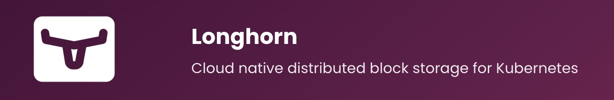
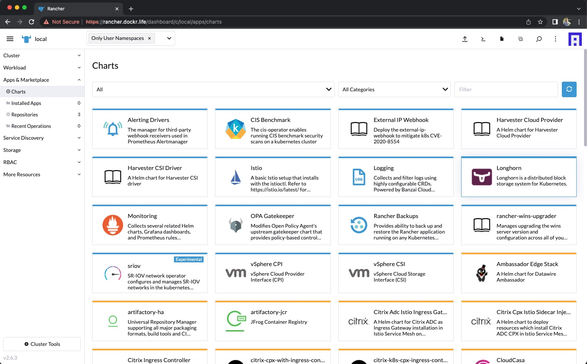
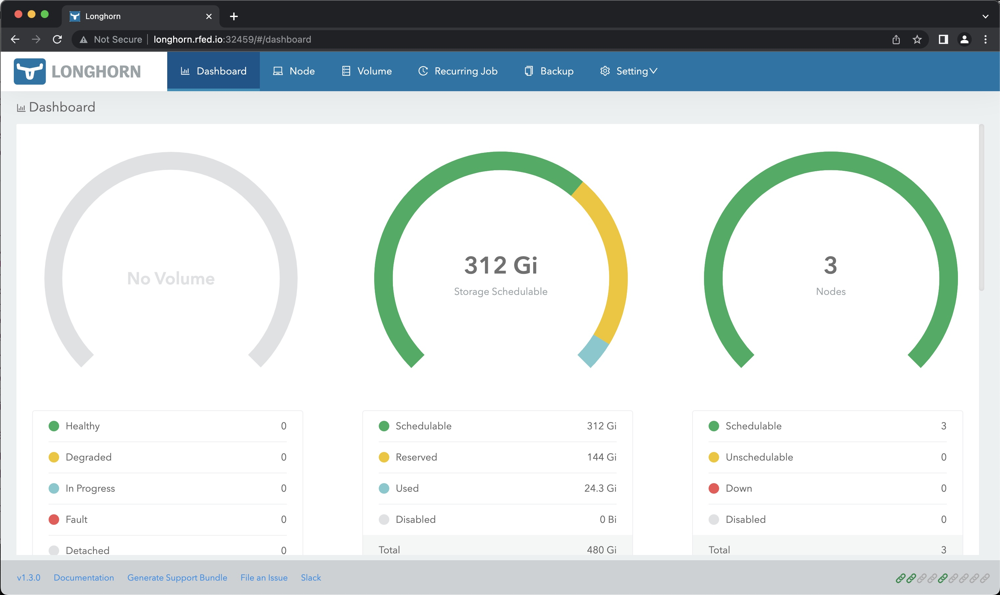
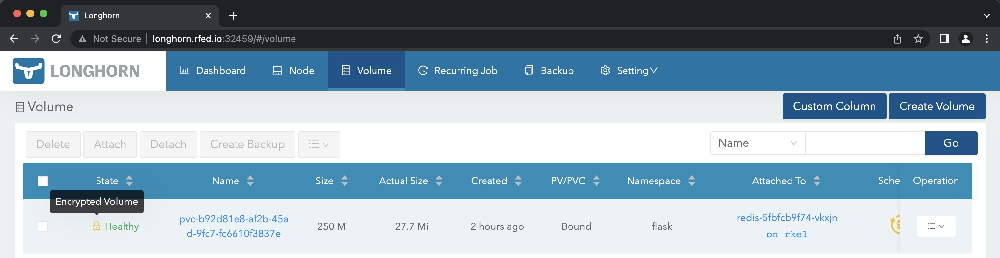

# Taking Advantage of Encryption at Rest with Longhorn



Data security is becoming an increasing importance with our customers. One of the great features of [Longhorn](https://longhorn.io) is the ability to encrypt the volumes at rest. Meaning the data on the nodes are encrypted. 

From the [docs](https://longhorn.io/docs/1.3.0/advanced-resources/security/volume-encryption/) : *An encrypted volume results in your data being encrypted while in transit as well as at rest, this also means that any backups taken from that volume are also encrypted.*

We will need a few tools for this guide. We will walk through how to install `helm` and `kubectl`.

Before getting started we should probably take a look at a post for setting up [RKE2, Rancher, and Longhorn](https://github.com/clemenko/rke_install_blog).

---

> **Table of Contents**:
>
> * [Whoami](#whoami)
> * [Prerequisites](#prerequisites)
> * [Linux Servers and Kubernetes](#linux-servers-and-kubernetes)
> * [Longhorn](#longhorn)
>   * [Longhorn Install](#longhorn-install)
>   * [Longhorn Gui](#longhorn-gui)
>   * [Enabling Encryption](#enabling-encryption)
>   * [Using Encryption](#using-encryption)
> * [Automation](#automation)
> * [Conclusion](#conclusion)

---

## Whoami

Just a geek - Andy Clemenko - @clemenko - andy.clemenko@rancherfederal.com

## Prerequisites

The prerequisites are fairly simple. We need a kubernetes cluster with access to the internet. They can be bare metal, or in the cloud provider of your choice. I prefer [Digital Ocean](https://digitalocean.com). We need an `ssh` client to connect to the servers. And finally DNS to make things simple. Ideally we need a URL for the Rancher interface. For the purpose of the this guide let's use `longhorn.rfed.io`. We will need to point that name to the first server of the cluster. While we are at it, a wildcard DNS for your domain will help as well.

## Linux Servers and Kubernetes

Cheat code for installing [RKE2, Rancher, and Longhorn](https://github.com/clemenko/rke_install_blog).

For the sake of this guide we are going to use [Rocky Linux](https://rockylinux.org/). Honestly any OS will work. Our goal is a simple deployment. The recommended size of each node is 4 Cores and 8GB of memory with at least 60GB of storage. One of the nice things about [Longhorn](https://longhorn.io) is that we do not need to attach additional storage. Here is an example list of servers. Please keep in mind that your server names can be anything.

| name | ip | memory | core | disk | os |
|---| --- | --- | --- | --- | --- |
|rke1| 142.93.189.52  | 8192 | 4 | 160 | Rocky Linux RockyLinux 8.5 x64 |
|rke2| 68.183.150.214 | 8192 | 4 | 160 | Rocky Linux RockyLinux 8.5 x64 |
|rke3| 167.71.188.101 | 8192 | 4 | 160 | Rocky Linux RockyLinux 8.5 x64 |

We will need to make sure we have the `iscsi` packages installed. It is needed for Longhorn to expose RWX volumes. `SSH` into the nodes and install `iscsi`.

```bash
yum install -y nfs-utils cryptsetup iscsi-initiator-utils; systemctl start iscsid.service; systemctl enable iscsid.service
```

As for Kubernetes, you can install any that you want. It is highly recommended to have an ingress controller as well. This will help getting to Longhorn's dashboard. We can use NodePort if needed.

## Longhorn

### Longhorn Install

There are several methods for installing. Rancher has Chart built in.



Now for the good news, [Longhorn docs](https://longhorn.io/docs/1.3.0/deploy/install/) show two easy install methods. Helm and `kubectl`. Let's stick with `kubectl` for this guide.

```bash
# from https://longhorn.io/docs/1.3.0/deploy/install/install-with-kubectl/
kubectl apply -f https://raw.githubusercontent.com/longhorn/longhorn/v1.3.0/deploy/longhorn.yaml
```

Here is what to expect.

```bash
$ kubectl apply -f https://raw.githubusercontent.com/longhorn/longhorn/v1.3.0/deploy/longhorn.yaml
namespace/longhorn-system created
Warning: policy/v1beta1 PodSecurityPolicy is deprecated in v1.21+, unavailable in v1.25+
podsecuritypolicy.policy/longhorn-psp created
serviceaccount/longhorn-service-account created
configmap/longhorn-default-setting created
configmap/longhorn-storageclass created
customresourcedefinition.apiextensions.k8s.io/backingimagedatasources.longhorn.io created
customresourcedefinition.apiextensions.k8s.io/backingimagemanagers.longhorn.io created
customresourcedefinition.apiextensions.k8s.io/backingimages.longhorn.io created
customresourcedefinition.apiextensions.k8s.io/backups.longhorn.io created
customresourcedefinition.apiextensions.k8s.io/backuptargets.longhorn.io created
customresourcedefinition.apiextensions.k8s.io/backupvolumes.longhorn.io created
customresourcedefinition.apiextensions.k8s.io/engineimages.longhorn.io created
customresourcedefinition.apiextensions.k8s.io/engines.longhorn.io created
customresourcedefinition.apiextensions.k8s.io/instancemanagers.longhorn.io created
customresourcedefinition.apiextensions.k8s.io/nodes.longhorn.io created
customresourcedefinition.apiextensions.k8s.io/orphans.longhorn.io created
customresourcedefinition.apiextensions.k8s.io/recurringjobs.longhorn.io created
customresourcedefinition.apiextensions.k8s.io/replicas.longhorn.io created
customresourcedefinition.apiextensions.k8s.io/settings.longhorn.io created
customresourcedefinition.apiextensions.k8s.io/sharemanagers.longhorn.io created
customresourcedefinition.apiextensions.k8s.io/snapshots.longhorn.io created
customresourcedefinition.apiextensions.k8s.io/volumes.longhorn.io created
clusterrole.rbac.authorization.k8s.io/longhorn-role created
clusterrolebinding.rbac.authorization.k8s.io/longhorn-bind created
role.rbac.authorization.k8s.io/longhorn-psp-role created
rolebinding.rbac.authorization.k8s.io/longhorn-psp-binding created
service/longhorn-backend created
service/longhorn-frontend created
service/longhorn-conversion-webhook created
service/longhorn-admission-webhook created
service/longhorn-engine-manager created
service/longhorn-replica-manager created
daemonset.apps/longhorn-manager created
deployment.apps/longhorn-driver-deployer created
deployment.apps/longhorn-ui created
deployment.apps/longhorn-conversion-webhook created
deployment.apps/longhorn-admission-webhook created
```

Fairly easy right?

Make sure everything is up with `kubectl get pod -n longhorn-system`.

```bash
$ kubectl get pod -n longhorn-system | grep -v Running
NAME                                          READY   STATUS    RESTARTS   AGE
```

### Longhorn GUI

This is going to be dependent upon your ingress controller. Personally I prefer [Traefik](https://traefik.io/). For the sake of simplicity we can use a NodePort service. We will need to create new service for this.

```bash
cat <<EOF | kubectl apply -f -  > /dev/null 2>&1
apiVersion: v1
kind: Service
metadata:
  name: longhorn-np
  namespace: longhorn-system
spec:
  ports:
  - name: http
    port: 80
    protocol: TCP
    targetPort: http
  selector:
    app: longhorn-ui
  type: NodePort
EOF
```

Now we can get the port number. Notice the number at the end that is over 32000. That is the port we need to connect with.

```bash
$ kubectl get svc -n longhorn-system  | grep longhorn-np
longhorn-np                   NodePort    10.43.45.192    <none>        80:32459/TCP   35s
```

In my case I will navigate to http://longhorn.rfed.io:32459.



Since the dashboard is up we can run `kubectl get sc` to show the storage classes.

```text
$ kubectl get sc
NAME                 PROVISIONER          RECLAIMPOLICY   VOLUMEBINDINGMODE   ALLOWVOLUMEEXPANSION   AGE
longhorn (default)   driver.longhorn.io   Delete          Immediate           true                   27m
```

Now we have a default storage class for the cluster. This allows for the automatic creation of Physical Volumes (PVs) based on a Physical Volume Claim (PVC).

### Enabling Encryption

Based on [docs](https://longhorn.io/docs/1.3.0/advanced-resources/security/volume-encryption/) we can choose to enable the encryption per volume or globally. I prefer per volume. This will work nicely for any environment, including multi-tenant ones. We can set up a StorageClass to handle this. Notice the StorageClass is going to match the PVC and the Secret names.

```bash
cat <<EOF | kubectl apply -f -  > /dev/null 2>&1
kind: StorageClass
apiVersion: storage.k8s.io/v1
metadata:
  name: longhorn-crypto-per-volume
provisioner: driver.longhorn.io
allowVolumeExpansion: true
parameters:
  numberOfReplicas: "3"
  staleReplicaTimeout: "2880" # 48 hours in minutes
  fromBackup: ""
  encrypted: "true"
  csi.storage.k8s.io/provisioner-secret-name: \${pvc.name}
  csi.storage.k8s.io/provisioner-secret-namespace: \${pvc.namespace}
  csi.storage.k8s.io/node-publish-secret-name: \${pvc.name}
  csi.storage.k8s.io/node-publish-secret-namespace: \${pvc.namespace}
  csi.storage.k8s.io/node-stage-secret-name: \${pvc.name}
  csi.storage.k8s.io/node-stage-secret-namespace: \${pvc.namespace}
EOF
```

We can now validate everything worked as expected with `kubectl get sc`

```bash
$ kubectl get sc
NAME                         PROVISIONER          RECLAIMPOLICY   VOLUMEBINDINGMODE   ALLOWVOLUMEEXPANSION   AGE
longhorn (default)           driver.longhorn.io   Delete          Immediate           true                   45m
longhorn-crypto-per-volume   driver.longhorn.io   Delete          Immediate           true                   51s
```

### Using Encryption

In order to take advantage of the encrypted volumes we will need to set up a *secret* to store the encryption key. We will need to change the passphrase to something secure. We will also want to scope it to the applications namespace. Here is an example from a Flask application we will deploy in a later section. From the docs: *Example secret your encryption keys are specified as part of the CRYPTO_KEY_VALUE parameter. We use stringData as type here so we don’t have to base64 encoded before submitting the secret via kubectl create.* Basically we can use a simple string for the `CRYPTO_KEY_VALUE`.

**PLEASE note that the name of the Secret has to name of the PVC!**

```yaml
apiVersion: v1
kind: Secret
metadata:
  name: redis
  namespace: flask
stringData:
  CRYPTO_KEY_VALUE: "flaskisthebestdemoapplication"
  CRYPTO_KEY_PROVIDER: "secret"
```

We can now create a PVC using the storage class.

```bash
cat <<EOF | kubectl apply -f -  > /dev/null 2>&1
kind: PersistentVolumeClaim
apiVersion: v1
metadata:
  name: redis
  namespace: flask
  labels:
    app: redis
spec:
  storageClassName: "longhorn-crypto-per-volume"
  accessModes: 
    - ReadWriteMany
  resources:
    requests:
      storage: 250Mi
EOF
```

For demo purposes we can use a [demo yaml](https://github.com/clemenko/k8s_yaml/blob/master/flask_simple_nginx.yml).

Basically it is as simple as `kubectl apply -f https://raw.githubusercontent.com/clemenko/k8s_yaml/master/flask_simple.yml`.

```bash
$ kubectl apply -f https://raw.githubusercontent.com/clemenko/k8s_yaml/master/flask_simple.yml
namespace/flask created
deployment.apps/flask created
deployment.apps/redis created
secret/redis created
persistentvolumeclaim/redis created
service/flask created
service/redis created
ingress.networking.k8s.io/flask created
ingressroute.traefik.containo.us/flask-ingressroute created
```

Once deployed we can validate in the gui by going to the Volumes tab and looking at the icon.



**Huzzah!**

## Automation

Why of course we can automate this. Here is a function for doing such a thing : https://github.com/clemenko/rke2/blob/master/k3s.sh#L281

## Conclusion

Hopefully this post demonstrates how easy it is to enable encrypted volumes in Longhorn.


